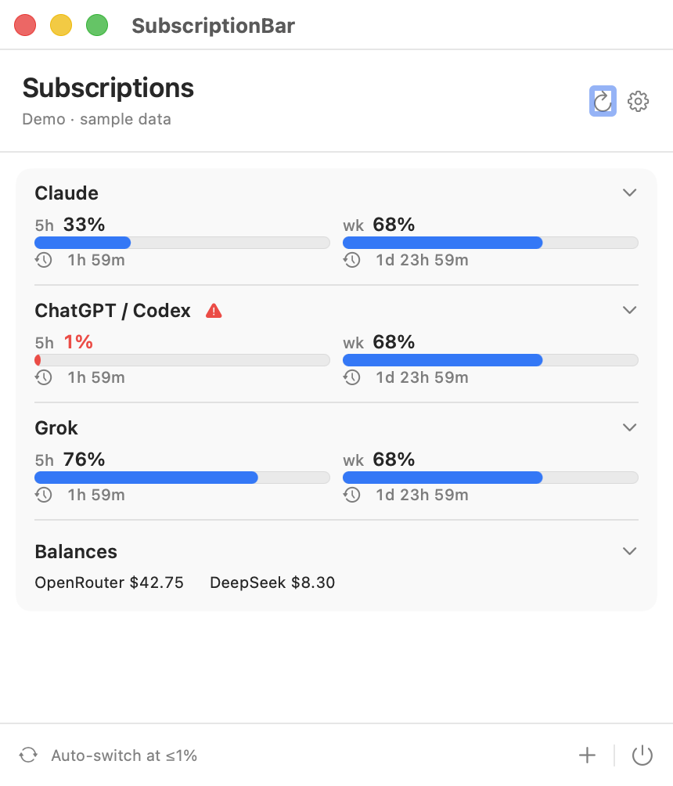
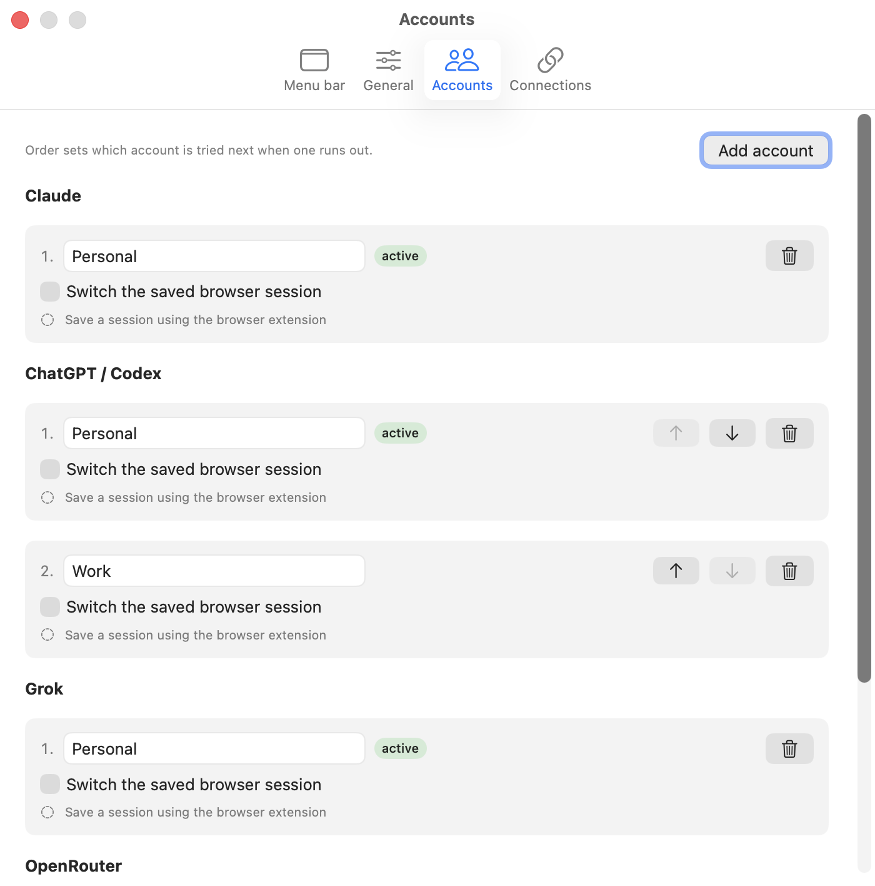
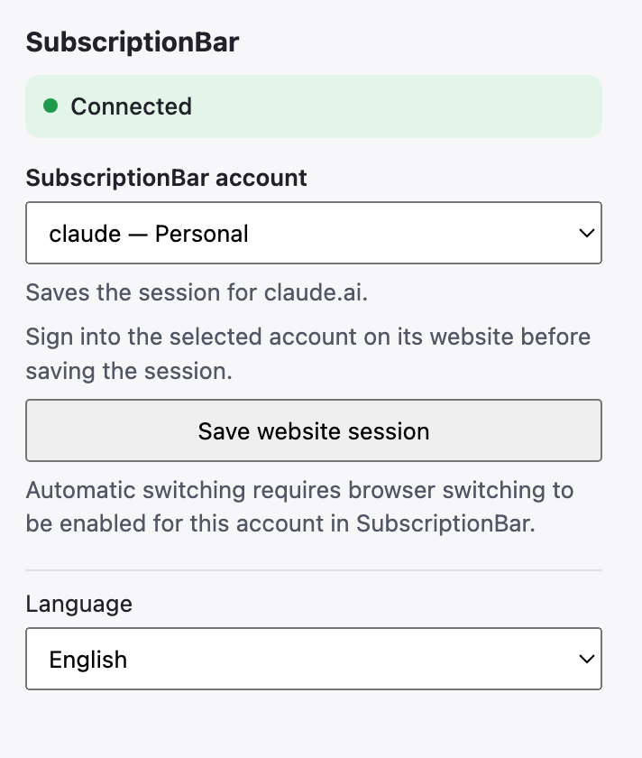
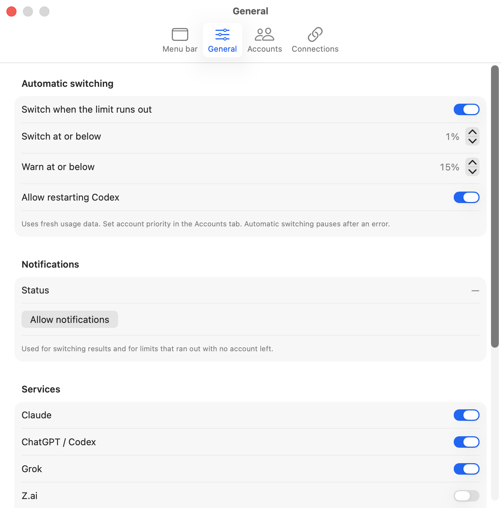

# SubscriptionBar

One macOS menu bar icon for the limits of every AI subscription you already pay for.

[](https://github.com/malakhov-dmitrii/subscriptionbar/actions/workflows/ci.yml)
[](LICENSE)


Русская версия: [README.ru.md](README.ru.md).
Screenshots below are demo mode (`--demo`): the data in them is invented.

<p align="center">
  
</p>

`C` is Claude, `X` is Codex, `G` is Grok. Numbers are what is **left**, not what
is used. A `!` marks the service that is about to run out; the icon changes too,
because macOS renders menu bar text as a monochrome template and colour would be
stripped.

<p align="center">
  
</p>

## What it does

- **Reads limits** for Claude Code, Codex and Grok CLI, plus optional Z.ai,
  OpenCode Go, Kimi Code, Cursor, OpenRouter and DeepSeek.
- **Switches accounts** for Claude, Codex and Grok when one runs out, using the
  priority you set. Every step is verified before and after it writes.
- **Stays local.** No server, no telemetry, no proxying of your requests.
  Credentials live in the macOS Keychain; the app talks only to each provider's
  own usage endpoint.

## What it does not do

This list is the point, not a disclaimer. The project refuses to guess.

- A missing, malformed or out-of-range reading is **never** treated as zero, and
  never triggers a switch.
- Switching a native sign-in and switching browser cookies are not one atomic
  operation. On a partial result the app keeps the new native account, reports
  the browser failure and pauses automation.
- Codex gets a normal quit request. There is no force kill, and if the quit is
  declined or takes over 30 seconds the sign-in is not changed.
- A running CLI process may keep its old sign-in in memory. Task resumption
  after a switch is **not verified**.
- Claude Desktop, ChatGPT Desktop and Safari are not integrated.
- Applying saved cookies does not prove the website server accepted that account.
  The app says so instead of claiming success.

Every provider endpoint, its public source and its exact contract are documented
in [PROVIDER-SOURCES.md](PROVIDER-SOURCES.md).

## Install

Requires macOS 14 or later. No dependencies beyond the Swift toolchain.

```sh
git clone https://github.com/malakhov-dmitrii/subscriptionbar.git
cd subscriptionbar
SUBSCRIPTIONBAR_ADHOC=1 scripts/package-app.sh   # builds dist/SubscriptionBar.app
open dist/SubscriptionBar.app
```

`SUBSCRIPTIONBAR_ADHOC=1` signs the bundle ad-hoc, which is what you want when
building for yourself. Without it the script demands a Developer ID identity and
**refuses to fall back silently**: changing the signature invalidates the
Keychain trust an existing install already has, so that has to be a decision,
not a default. Set `SUBSCRIPTIONBAR_SIGNING_IDENTITY` to use your own certificate.

Packaging the Firefox companion needs Node.js; everything else is Swift only.

## Try it without touching anything

```sh
open dist/SubscriptionBar.app --args --demo
```

Demo mode uses sample data: no Keychain, no network, no files read or written.

```sh
open dist/SubscriptionBar.app --args --preview-only
```

Preview mode shows your real last-known readings with their age, and disables
Keychain, network and switching entirely.

## Connecting an account

1. Sign in to the client as usual (`claude`, `codex`, `grok`).
2. Press `+` in SubscriptionBar and save that account under a name.
3. Sign in to your **second** account in the same client, and save it too.

SubscriptionBar copies the credentials it finds into its own Keychain entry. It
never asks you to type a subscription password. API-key services take the key in
a secure field instead.

Accounts you have saved are listed in order of priority. That order is what
rotation follows when one runs out.

<p align="center">
  
</p>

For browser sessions, Settings → Connections walks through the three steps: run
the installer once, load the extension folder, then save a session per account.
The companion extension saves one website session per account:

<p align="center">
  
</p>

## Automatic switching

- Triggers when a shared limit window drops to the configured threshold
  (1% by default, adjustable in Settings → General).
- A separate warning threshold (15% by default) colours the interface earlier
  without switching anything.
- Both the current and the next account need a successful reading under 90
  seconds old; the target is re-checked immediately before anything is written.
- The previous sign-in is saved first. Partial write failures roll back unless
  the client changed its own credentials meanwhile.
- After a switch there is a 120 second pause. After an error, automation stops
  and waits for you.

<p align="center">
  
</p>

## Development

```sh
scripts/verify.sh   # Swift tests, extension tests, syntax and script checks
swift build
swift test
```

The CI workflow runs exactly `scripts/verify.sh` on macOS.

Layout: `Sources/SubscriptionCore` holds the provider adapters, rotation policy,
Keychain vault and localization; `Sources/SubscriptionBar` holds the SwiftUI
interface; `browser-extension/` holds the Chrome extension, with the Firefox
build generated from the same sources by `build-firefox.mjs`.

## Security

Credential handling, threat model and reporting: [SECURITY.md](SECURITY.md).

## License

MIT — see [LICENSE](LICENSE).
